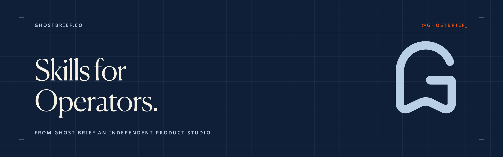

  

# Skills for Operators

The agent skills we use to run Ghost Brief, published straight from the studio.

A skill is a small instruction file that teaches an AI assistant a repeatable discipline. Most AI output comes out generic because the model is writing from a blank prompt, with none of the context that makes work specific. These files encode that context. Each one holds a method we actually use, written so an agent can run it the same way every time.

They're small and brand-agnostic, written to be edited. Take them and fold them into your own setup.

## The skills

**[conversion-copy](skills/conversion-copy/SKILL.md)**: a voice-of-customer copywriting engine for decision surfaces (sales pages, landing pages, emails, ads). It codes real customer language, selects a framework from the shape of the hook, and returns a few options that take different angles.

**[no-slop-filter](skills/no-slop-filter/SKILL.md)**: a writing system that strips recognizable AI patterns from prose before delivery, built on a list of the constructions that make writing read as machine-made.

**[brand-voice-architect](skills/brand-voice-architect/SKILL.md)**: an interview engine that turns scattered copy preferences into brand writing guidelines substantive enough for an AI to write from reliably.

We recommend using these skills together. Each skill serves a specific purpose, and when you combine them all they can help you build a voice and writing system for any brand with stronger, more consistent outputs.

## Install

**Claude (claude.ai)**: download the packaged file for the skill you want from [`dist/`](dist/) and upload it as a skill in your Claude settings. This is the fastest path if you don't work in a terminal.

**Claude Code and other agents**: copy the skill's folder from [`skills/`](skills/) into the skills directory of your project.

Although these skills stack well and work in tandem, you can also get value from using them solo.

## Why we publish these

Ghost Brief is an independent product studio. We build products and systems for operators, and we document the work as we go. This repo is part of that. The skills here are the ones we run daily, and when the real workflow changes, these files change with it.

The working notes behind them run in The Brief, our newsletter on what we're building and what we're learning.

**[Subscribe to The Brief →](https://brief.ghostbrief.co)**

## Use

Use these freely in your own work and in client work. Attribution is appreciated. Please don't repackage the repo itself for sale.

---

[ghostbrief.co](https://ghostbrief.co) | @ghostbrief_
